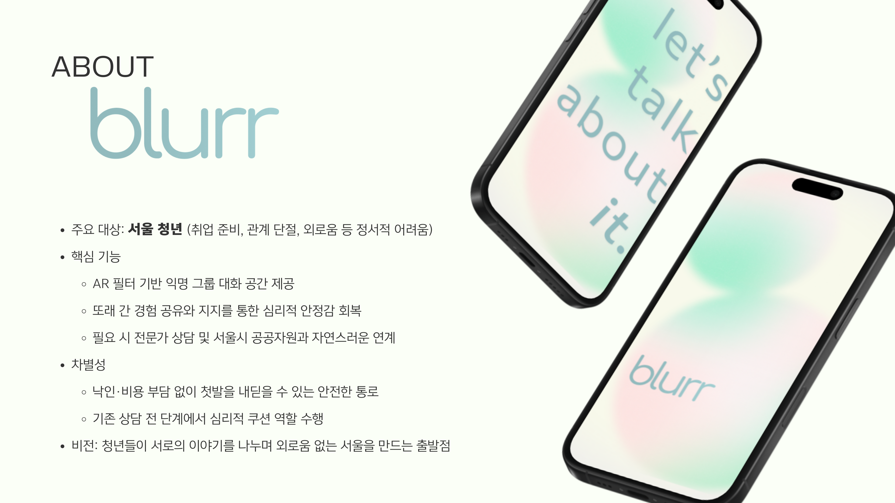

# blurr : 흐려서 다시 그리는 마음의 공간 
<p align="center">
  
</p>


- 🫥 익명으로 이야기할 수 있어요.
- 🎧 실시간 음성 변조로 목소리를 보호할 수 있어요.
- 🤖 AI 사회자가 대화를 안전하게 이끌어줘요.
- 🚨 위험 신호를 자동으로 감지할 수 있어요.
- 🎭 AR 필터로 부담 없이 참여할 수 있어요.
 
## 🎬 시연 영상

[](https://youtu.be/f17hUKxD40I?si=QWGlzGnhmBqF4agV&t=48)

<p align="center">
  <a href="https://youtu.be/f17hUKxD40I?si=QWGlzGnhmBqF4agV&t=48">
    👉 동영상으로 시연 보기
  </a>
</p>

## 📁 Project Structure

```text
lib/
  main.dart
  config/
    routes.dart
    env.dart
  core/
    constants/
    utils/
  features/
    onboarding/
      onboarding_page.dart
    session/
      session_page.dart
      session_flow_controller.dart
      risk_detector_adapter.dart
    safety/
      safety_banner.dart
    auth/
      login_page.dart
      signup_page.dart
  services/
    livekit_service.dart
    stt_service.dart
    api_client.dart
  widgets/
    blurr_avatar.dart
    common_button.dart

assets/
  images/
  lottie/
  icons/

android/
ios/
web/
windows/

pubspec.yaml
README.md

